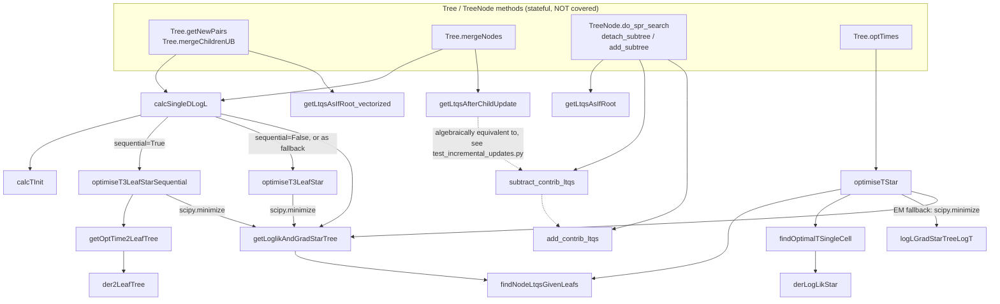
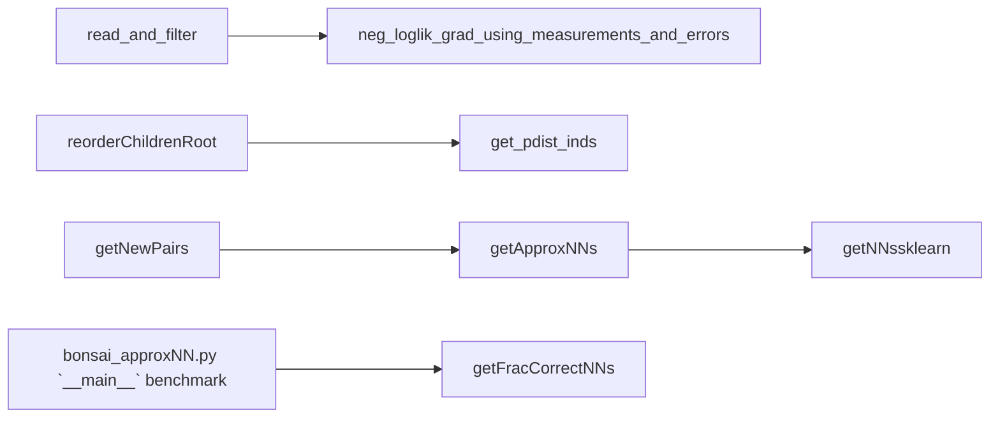

# Testing *Bonsai*'s numerical core

## Running the tests

```bash
pip install -r requirements-dev.txt    # adds pytest on top of requirements.txt
pytest                                 # run everything
pytest -v                              # verbose, one line per test
pytest tests/test_pairwise_merge_dlogl.py -v   # run a single file
pytest tests/test_pairwise_merge_dlogl.py::test_dlogl_prefers_similar_pairs_over_dissimilar_pairs # run a single test
```

## What's covered

| Test file | Functions under test | What it checks |
|---|---|---|
| `test_two_leaf_branch_length.py` | `der2LeafTree`, `getOptTime2LeafTree`, `getLoglik2LeafTree` | Optimal diffusion time between two leaves: analytic closed-form cases, the zero-clamp boundary, and the analytic derivative vs. a finite-difference check. |
| `test_star_node_position.py` | `findNodeLtqsGivenLeafs`, `findNodeLtqsGivenLeafsSingleGene` | The core "combine children into a parent" step: weighted-average identities, precision-is-sum-of-weights, single-gene/vectorised agreement. |
| `test_star_tree_component_optimisers.py` | `findOptimalTSingleCell`, `derLogLikStar`, `optimiseT3LeafStar`, `optimiseT3LeafStarSequential` | The EM single-step time optimiser (against an analytic solution) and the two specialised 3-leaf optimisers (cross-checked against each other and against `optimiseTStar`). |
| `test_star_tree_time_optimisation.py` | `optimiseTStar`, `logLGradStarTreeLogT`, `getLoglikAndGradStarTree` | The general N-child star-tree time optimiser: first-order optimality at convergence, and a direct finite-difference check of the shared log-likelihood/gradient function. |
| `test_pairwise_merge_dlogl.py` | `calcSingleDLogL` | The pairwise merge-scoring function that drives which nodes Bonsai merges next: the "merging never decreases likelihood" invariant, and that similar pairs score higher than dissimilar ones. |
| `test_reroot_as_if_root.py` | `getLtqsAsIfRoot`, `getLtqsAsIfRoot_vectorized` | The "reroot" primitive, verified against an independently computed reference position/precision, plus the root-fully-dominates degenerate case. |
| `test_incremental_updates.py` | `subtract_contrib_ltqs`, `add_contrib_ltqs`, `getLtqsAfterChildUpdate` | Incrementally adding/removing/swapping one child's contribution to a parent, cross-checked against recomputing the parent from scratch. |
| `test_gene_variance_estimation.py` | `neg_loglik_grad_using_measurements_and_errors`, `loglik_given_true_var_log`, `infer_true_var_log` | Per-gene variance estimation used in `read_and_filter`; gradient check; cross-check against the (unused) reference implementation. |
| `test_pdist_index.py` | `get_pdist_inds` | Condensed-distance-matrix indexing, checked directly against `scipy.spatial.distance.pdist`'s actual ordering. |
| `test_branch_length_init.py` | `calcTInit` | Initial branch-length guesses fed to the optimisers above. |
| `test_nn_recall.py` | `getFracCorrectNNs` | NN-search accuracy metric used in `bonsai_approxNN.py`'s standalone benchmarking script. |

180 tests total (`pytest --collect-only -q`).

## Call graph of the tested core

This traces how the tree-merge scoring path actually calls into the tested
functions (solid arrows = direct calls; the `Tree`/`TreeNode` methods at the
top are the *only* stateful, untested entry points — everything below them
is pure and covered).



Note: `logLGradStarTreeLogT` is a **separate, self-contained
reimplementation** of the same log-likelihood/gradient as
`getLoglikAndGradStarTree` (it doesn't call it, or `findNodeLtqsGivenLeafs`
— it recomputes the weighted average inline). It exists because
`optimiseTStar`'s gradient-based fallback path needs one function that does
both the E-step (recompute `xr_g`/`W_g`) and the log-likelihood/gradient in a
single call for `scipy.optimize.minimize`.

Separate from the tree-merge path, and independent of it:



## Testing *Bonsai-scout*

The core suite above only covers the numerical Bonsai algorithm; it doesn't
touch the *Bonsai-scout* Shiny app at all. `bonsai_scout/tests/` covers the
app itself with real browser-driven end-to-end tests, using Shiny's own
Playwright-based testing framework. It needs the `bonsai_scout` conda env
(not `bonsai`), so it's kept out of root `pytest.ini`'s `testpaths = tests`
and run as a separate, explicit invocation:

```bash
conda activate bonsai_scout
pip install -r requirements-dev_bonsai_scout.txt   # adds pytest + pytest-playwright
playwright install chromium                        # one-time headless-browser download
pytest bonsai_scout/tests -v
```

Each test launches the real app as a subprocess against a tiny 64-cell
example dataset (built fresh into a temp dir by the `example_results_folder`
fixture in `bonsai_scout/tests/conftest.py`, mirroring the README's
"Example 1"), drives it with a headless Chromium page, and asserts on the
rendered DOM — e.g. `test_gene_expression_search.py` types into the Gene
expression tab's filter box, confirms the table narrows, selects a row, then
switches accordion tabs away and back to confirm the filtered/selected state
survives (the specific bug that `filters=False` was previously working
around).
